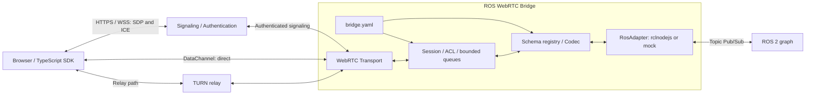

# ROS 2 / WebRTC DataChannel Bridge Design

Status: conceptual design and connection proof of concept. Section 14 records implemented and verified scope. Do not interpret all v0.1 goals, support matrices, or performance conditions below as achieved.

## 1. Recommended approach and assumptions

**Build an independent, configuration-driven Topic bridge. Use TypeScript/rclnodejs while separating WebRTC, sessions, and type conversion.** It should run alongside other Gateways as an independent service connected to the same ROS graph.

Assume the first users are browser monitoring and control UIs. Native clients can implement the same wire protocol. One process connects to one ROS domain and accepts multiple WebRTC peers. Transparent DDS network extension between ROS 2 systems is out of scope.

The initial value is bidirectional exchange of small-to-medium Topics with application-appropriate delivery settings. Large sensor data is not a mandatory use case; binary/CDR and fragmentation are not priorities. Sensor message types are not inherently prohibited: messages are supported when their codec is available and their payload fits the limits.

WebRTC alone does not guarantee low latency or successful communication. WAN connections require signaling and, in some environments, TURN.

## 2. Design principles

- Expose Topics through declarative configuration without individual Topic handlers.
- Separate signaling, the session router, and the ROS adapter. Keep the ROS adapter interface small and independent of HTTP/WebRTC.
- Give mock and real ROS adapters a shared contract while separating protocol tests from real ROS tests.
- Generate public catalogs and JSON Schemas from ROS interfaces, avoiding duplicate definitions in configuration.
- Preserve ROS message structure by default. Do not include an arbitrary field-mapping DSL in the initial version.
- Publisher/subscription sharing keys include the resolved Topic, type, and normalized ROS QoS; do not accidentally share different QoS configurations.
- Convert according to ROS schemas, never inferring integers from ordinary string contents. Validate fixed arrays and other constraints in both directions.
- Separate ongoing subscriptions from explicit snapshots and provide QoS checks and session-bound authorization.

## 3. Architecture



- **RosAdapter**: type loading, ROS entity creation/destruction, publication, subscriptions, and QoS diagnostics. Does not know WebRTC.
- **SchemaRegistry / Codec**: ROS definitions, wire schemas, validation, encode/decode. Does not know transport.
- **SessionRouter**: Topic/type/direction authorization, logical subscriptions, publish handles, sequences, queues, and rates.
- **WebRtcTransport**: PeerConnection, DataChannels, ICE, send buffers, and connection state. Does not know ROS.
- **SignalingAdapter**: authenticated SDP/ICE exchange. Connects local HTTP and external rendezvous approaches to the same session creation path.

Extract shared libraries only after common interfaces stabilize. The Gateway must start and operate independently.

## 4. Implementation technology comparison

| Candidate | Advantages | Constraints and decision |
| --- | --- | --- |
| TypeScript + rclnodejs + node-datachannel | Unified TS application; libdatachannel Node bindings provide delivery settings and buffer APIs | node-datachannel/libdatachannel are MPL-2.0 and excluded by this project's dependency policy |
| TypeScript + rclnodejs + werift | Same application structure with a TS WebRTC stack; werift itself is MIT | Preferred evaluation candidate. Review transitive dependencies/distribution artifacts and test browser interoperability and congestion load |
| Python + rclpy + aiortc | Convenient standard ROS Python types and asyncio | SDK/server use different languages; executor and asyncio ownership must be separated |
| C++ + rclcpp + libdatachannel | Supports GenericSubscription/GenericPublisher and serialized data | Excluded due to MPL-2.0. If C++ becomes necessary, evaluate a policy-compliant transport separately |

**Use TypeScript and rclnodejs, with the license-reviewed werift core described in §14 for the WebRTC connection PoC.** Keep SDK/server types and contracts easy to align and follow the dependency policy in [`CONTRIBUTING.md`](../CONTRIBUTING.md).

The project uses [`Apache-2.0`](../LICENSE). Record dependency and distribution licenses for every adopted version and retain required copyright/license notices.

Primary references: [rclnodejs](https://github.com/RobotWebTools/rclnodejs), [node-datachannel](https://github.com/murat-dogan/node-datachannel), [API](https://github.com/murat-dogan/node-datachannel/blob/master/API.md), [werift](https://github.com/shinyoshiaki/werift-webrtc), [aiortc](https://aiortc.readthedocs.io/en/latest/), [libdatachannel](https://github.com/paullouisageneau/libdatachannel).

## 5. Configuration and public contracts

Use `bridge.yaml` as the configuration authority, validated at startup with JSON Schema. Use OpenAPI for HTTP signaling/catalog APIs; define the DataChannel protocol through a separate versioned specification and JSON Schema. AsyncAPI output is a possible future artifact, not a required v0.1 dependency. [AsyncAPI specification](https://www.asyncapi.com/docs/reference/specification/v3.0.0)

`web_to_ros` means a Web client sends and the Gateway publishes to ROS; `ros_to_web` is the reverse. Names should make the publisher's role unambiguous.

Public Web names normally match ROS Topic names. Keys in `topics` are public names; if `ros_topic` is absent, use the key as the ROS Topic name too. Specify `ros_topic` only when an alias is needed. Expose only configured Topics, never automatically expose the ROS graph.

```yaml
version: 1
robot_id: robot-01
limits:
  max_peers: 4
  max_message_bytes: 16384
  max_peer_queue_bytes: 262144
  max_channel_buffered_bytes: 65536
topics:
  /odom:
    ros_type: nav_msgs/msg/Odometry
    direction: ros_to_web
    ros_qos:
      reliability: best_effort
      durability: volatile
      history: keep_last
      depth: 5
    delivery: realtime
    max_rate_hz: 20
    queue: { policy: latest, max_messages: 1 }
  /cmd_vel:
    ros_type: geometry_msgs/msg/Twist
    direction: web_to_ros
    ros_qos:
      reliability: reliable
      durability: volatile
      history: keep_last
      depth: 1
    delivery: realtime
    max_rate_hz: 30
    queue: { policy: latest, max_messages: 1 }
    access: { publish_scope: teleop, exclusive_writer: true }
    command_guard: { required: true, lease_ms: 250 }
```

These are initial evaluation values, not performance limits or safety standards. The example does not provide a complete authentication system: configure identity validation and permission policy separately. Unspecified permissions are denied. Choose leases for the target network and controller stopping requirements.

For example, rename the `/cmd_vel` key to `/operator/velocity` and add `ros_topic: /cmd_vel` to change only the public name. Apply ROS remapping to the destination; retain the configured key as the public Web name. Command writer ownership is managed per normalized, remapped ROS output Topic regardless of the number of aliases.

The catalog returns only authorized public names, types, directions, wire schema IDs, delivery modes, and size/rate limits. Later references to aliases mean these public names. Do not expose unconfigured Topics or arbitrary client-selected ROS types. HTTP schema retrieval must be authenticated and size-bounded; do not pack large schemas into a 16 KiB DataChannel message.

Initially, load configuration only at startup. Apply ACL revocation immediately through a separate session-management operation.

## 6. Connection and signaling

1. An authenticated client presents permission to connect to a robot.
2. The Gateway associates identity, robot, session ID, expiration, and allowed operations.
3. The browser is always the offerer, creating fixed-label DataChannels before SDP/ICE exchange. Extra channels and invalid delivery settings are rejected.
4. After connection, `hello` checks protocol major version, codec, and limits; the client opens only authorized catalog Topics.
5. Disconnection or revocation invalidates the session and discards queues, publish handles, and leases.

M0 uses directly reachable HTTPS offer/answer signaling and exchanges SDP after ICE gathering completes. Internet-oriented v0.1 adds a small rendezvous reached through outbound robot WSS and supports trickle ICE. TURN remains a separate service with configuration and verification instructions. Signaling exchanges connection information; TURN relays data when necessary.

Treat signaling as a trusted boundary and associate authenticated sessions with SDP fingerprints. TLS/DTLS alone does not authorize Topic operations. [WebRTC Security Architecture](https://www.rfc-editor.org/rfc/rfc8827.html)

On ICE failure, v0.1 creates a new PeerConnection and epoch. After reauthentication, the SDK may register subscriptions again but must not replay publish payloads or commands. Verify both direct and relay NAT traversal, explicitly naming measured TURN TCP/TLS and UDP-blocked combinations. [ICE](https://www.rfc-editor.org/rfc/rfc8445.html), [TURN](https://www.rfc-editor.org/rfc/rfc8656.html)

## 7. DataChannels and wire protocol

Multiplex Topics over three fixed channels per peer. Do not create a separate channel for each Topic.

| Label | Configuration | Purpose |
| --- | --- | --- |
| `ros.control.v1` | ordered / reliable | hello, subscribe, unsubscribe, advertise, unadvertise, lease, acknowledgements/errors |
| `ros.reliable.v1` | ordered / reliable | Small state updates prioritizing delivery over loss |
| `ros.realtime.v1` | unordered / maxRetransmits=0 | Latest-value telemetry and continuous setpoints |

Do not specify both `maxPacketLifeTime` and `maxRetransmits`. All channels share congestion control in one SCTP association, so separating channels does not guarantee bandwidth or latency. [WebRTC API](https://www.w3.org/TR/webrtc/), [RFC 8831 §5, §6.6](https://www.rfc-editor.org/rfc/rfc8831.html)

The protocol borrows rosbridge's publish/subscribe model but does not claim compatibility. Session permissions, codecs, handles, and acknowledgement semantics differ, requiring a dedicated SDK. [rosbridge protocol](https://github.com/RobotWebTools/rosbridge_suite/blob/ros2/ROSBRIDGE_PROTOCOL.md)

Example operations (identifiers are illustrative, not issued permissions):

```json
{"v":1,"op":"subscribe","id":"r1","topic":"/odom"}
{"v":1,"op":"subscribed","id":"r1","stream_id":"s1","epoch":"e1","schema_id":"sha256:…"}
{"v":1,"op":"message","stream_id":"s1","epoch":"e1","seq":"42","data":{"header":{},"pose":{},"twist":{}}}
```

The final `data` is abbreviated to explain structure; it is not valid complete Odometry input. `advertise` obtains a publisher handle for an authorized alias. `publish` sends that handle, epoch, seq, data, and a lease ID when required. The receiver also validates peer/session ownership. Publication must not accept freely chosen Topic names on each request.

Do not depend on arrival order between control and data. Delivery starts only after the client receives `subscribed` and sends `ready(stream_id)`. Register receive handlers before ready. The SDK discards in-flight messages after unsubscribe using tombstones and never reuses handles within a session.

- Correlate control requests by request ID. Bound duplicate-response caches by count and lifetime.
- `seq` is a monotonically increasing decimal string per stream/publisher handle. Gaps are allowed; reordered and duplicate values are discarded. With multiple ROS publishers, this is Gateway receipt order, not global ROS causality.
- Publication acknowledgements use `published_to_ros` and mean only that the ROS publish API succeeded, not controller receipt/completion or exactly-once delivery.
- Reliable stream overflow stops that stream as `slow_consumer`; do not silently pretend delivery is complete. Realtime streams discard old values and count drops.
- Reject protocol-major mismatches at connection time; explicitly error on unsupported features. Reject unknown operations, excessive JSON nesting, and invalid types/lengths.

## 8. ROS types and serialization

v0.1 uses `ros-json-v1`. ROS interfaces must be installed and their rclnodejs bindings generated. Adding custom types requires no Gateway code changes but does require distributing type packages and regenerating bindings. [rclnodejs interface generation](https://github.com/RobotWebTools/rclnodejs#ros-2-interface-message-generation)

| ROS type | Wire representation |
| --- | --- |
| bool / ordinary string / integers up to 32 bits | Standard JSON types, checked against ROS ranges |
| int64 / uint64 | Decimal strings; convert only fields identified as integers by the schema |
| float32 / float64 | Finite numbers; non-finite values use `"NaN"`, `"Infinity"`, or `"-Infinity"` only in float fields. Commands reject non-finite values |
| uint8 arrays | Base64 strings; validate decoded length and bounds |
| Other arrays / nested messages | Recursive arrays/objects; validate fixed lengths and bounded sequences/strings |
| Time / Duration | ROS sec/nanosec structure, distinct from wire receipt time |

Reject missing required fields, unknown fields, and out-of-range values without implicit zero-filling. Constants are documentation metadata, not enum constraints unless explicitly declared. Determine support for every configured type at startup; never expose unknown types with partial schemas.

Schema IDs hash a normalized wire schema including codec version. Distinguish them from ROS type hashes; schema changes require reconnection and handle recreation.

CDR is deferred. Add it only after specifying the binary header, serialization format, type identification, maximum size, and browser decoder together. Python also supports raw publish/subscription paths, so adopting CDR and rewriting in C++ are separate decisions. [rclpy publisher implementation](https://github.com/ros2/rclpy/blob/jazzy/rclpy/rclpy/publisher.py)

## 9. QoS, lifetime, and load control

Keep ROS QoS and WebRTC delivery settings independent. Reliable DataChannels cannot recover samples already lost by best-effort ROS delivery. Deadline, liveliness, and durability are not defined as transparently preserved through to the Web client.

Report QoS mismatches, such as a reliable subscription to a best-effort publisher. Monitor graph/configuration type mismatches, matched publisher counts, and incompatible QoS. [Official ROS 2 QoS documentation](https://raw.githubusercontent.com/ros2/ros2_documentation/jazzy/source/Concepts/Intermediate/About-Quality-of-Service-Settings.rst)

Initially, create configured ROS entities at startup. Web subscribe/unsubscribe only changes session delivery registrations; disconnection does not destroy shared ROS subscriptions. Streams forward new samples received by the Gateway after ready, without automatic history replay. Process shutdown releases all entities. Future lazy creation would require per-Topic/type/QoS reference counts and cache lifetimes.

When the same ROS Topic is exposed in both directions under different aliases, the Gateway's own publications can return to the Web as ordinary received ROS samples. The initial version does not guarantee full source identification or echo suppression. The SDK must not automatically republish received messages to ROS; cyclic bridge topologies are out of scope.

A Web snapshot is a separate feature returning the last sample received by the Gateway with timestamp/age. It does not replace DDS transient_local history or the full state of multiple publishers. Aggregating all `/tf_static` transforms and reproducing its history is explicitly outside v0.1 guarantees.

Bound every value through configuration and reject contradictions at startup.

- A v0.1 DataChannel message, including its UTF-8 envelope, must fit `min(configured limit, 16 KiB, negotiated transport limit)`. 16 KiB is a conservative application limit, not a universal WebRTC limit.
- v0.1 has no fragmentation. Image, point-cloud, LaserScan, and other types are not rejected solely by type, but oversized encoded messages receive explicit size errors.
- Bound messages per stream, queue bytes per peer, process-wide bytes, and DataChannel buffered bytes. Include telemetry caches in accounting.
- Resume transmission using `bufferedAmount` and low-watermark notifications. Prioritize control and never block ROS callbacks waiting for sends when limits are reached.
- Measure ROS-to-JS callback and event-loop notification backlogs too. If native pending delivery cannot be bounded, reduce subscription rates or isolate processes; application queues alone do not establish a memory bound.
- Isolate slow-peer queues from other peers. Coalesce latest values per alias and also bound control accumulation.

Topics on one reliable channel still wait for each other's ordering. If problematic, evaluate delivery groups or separate PeerConnections in a later version.

## 10. Commands and authorization

Separate monitoring from control permissions. Default-deny Topics, types, and directions: readable does not imply publishable. Apply token expiry, session revocation, and ACL changes to existing DataChannels.

Expose continuous setpoints such as `/cmd_vel` only under these conditions:

1. Limit each normalized, remapped ROS output Topic to one writer session. Explicit arm issues an expiring lease. Aliases reaching the same Topic share ownership; contradictory command settings fail at startup.
2. Bind lease IDs to session/epoch/handle and evaluate expiry on the Gateway's monotonic clock. A lease is valid only while `now < expires_at`; equality or later rejects. Re-arm to obtain a fresh ID after expiry.
3. The SDK generates commands from current input after receiving the lease. Never attach a new lease to an old payload or queue operations while disconnected.
4. Revalidate lease, epoch, sequence, ownership, types/values, and rate on receipt and immediately before ROS publication.
5. A delayed packet alone must not resume control after lease expiry. Use volatile DDS publishers so durability does not replay old commands.

This bounds the window in which old packets can be accepted but does not prove exactly when a client generated the payload. A TTL based only on a browser clock does not guarantee a bound on age since generation. Strict age guarantees require a separate clock-synchronization and error-bound design. `maxPacketLifeTime` is not a substitute for command expiration either.

**Gateway deadline validation ends immediately before ROS publication.** DDS/controller queues can still delay data; volatile durability does not prevent late delivery of ordinary in-flight commands. Provide controller-side input watchdogs. Where late commands must not restart motion, use a command type with controller-verifiable expiration/generation data or a dedicated command gate. The Twist configuration above does not establish that guarantee by itself.

A generic bridge must not infer stop messages from types. Include browser backgrounding, OS suspension, and Gateway crashes in stopping tests. Do not give Topic acknowledgements completion guarantees for one-off non-idempotent operations; design these later with Services/Actions or application response Topics.

## 11. MVP and development stages

| Stage | Deliverables and completion criteria |
| --- | --- |
| M0: Technical PoC | In separate Humble/Jazzy Docker environments, verify ROS→browser, browser→ROS, three channels, size limits, TURN, and target-CPU builds. Select TS transport libraries and versions |
| M1: LAN alpha | Configuration validation, type schemas, JSON codec, mock, Topic Pub/Sub, HTTP signaling, SDK, queues, and epochs. Public operation without authorization must not be the default |
| M2: OSS v0.1 | Authenticated rendezvous, TURN instructions, leases/ACL revocation, reconnection, diagnostics, Humble/Jazzy and multi-browser CI, distribution, bidirectional examples, and protocol documentation |
| M3: Extensions after measurement | Evaluate binary/CDR, bounded fragmentation, lazy entities, AsyncAPI export, and additional SDK languages based on demand. Large-sensor features are not initial prerequisites |

v0.1 covers Topics and, as a separate opt-in plane, receive-only H.264 video tracks sourced from `sensor_msgs/msg/Image` (section 15). It excludes Services, Actions, Parameters, audio, browser-to-ROS video, SFUs, multi-robot management UIs, and automatic ROS-to-ROS relaying.

Initial target environments are **ROS 2 Humble / Ubuntu 22.04 and ROS 2 Jazzy / Ubuntu 24.04**. Run distro containers independently and verify builds, bindings, bidirectional Pub/Sub, and QoS. Peer ROS nodes must join isolated test graphs without contaminating the host's existing ROS environment. [TESTS.md](../TESTS.md) defines both distro test conditions.

Linux amd64/arm64 are candidate architectures; finalize support from target hardware and native-dependency verification. Pin Node/rclnodejs versions and check in M0 whether common versions work across distros. These are support intentions, not completed support declarations.

Bidirectional examples publish from the Web to an input Topic and receive an output Topic from a ROS peer. Bindings specify verified types and QoS; never infer types from Topic names.

Proposed layout:

```text
packages/bridge/       # config, sessions, schemas, ros adapters, transport
packages/client/       # browser TypeScript SDK
packages/signaling/    # optional authenticated rendezvous
schemas/               # config / protocol JSON Schema
examples/              # chatter, odometry, guarded teleop
tests/                 # protocol, ROS integration, browser, network impairment
docs/                  # architecture, protocol, deployment, compatibility
```

## 12. QA and acceptance criteria

[TESTS.md](../TESTS.md) collects concrete acceptance criteria, test layers, environment matrices, and CI/release gates. This document defines features and guarantees; [CONTRIBUTING.md](../CONTRIBUTING.md) defines common quality requirements.

Verify type round trips, QoS compatibility, inter-channel ordering, resource limits, authorization, old-command rejection, connection paths, and cleanup. Mocks do not replace real ROS/browser/TURN verification. Evaluate controller deadline checks separately from the Gateway.

Diagnostics include peer counts, ICE state/direct or relay paths, ROS matched counts/QoS mismatches, per-Topic rate/bytes/drops, queue backlogs, bufferedAmount, and publication rejection reasons. Do not log payloads or authentication information by default.

Measure latency p50/p95/p99, CPU, RSS, and connection time with message size, rate, CPU, browser, and network conditions recorded. Do not treat timestamps from different devices as one-way latency without synchronization-error assessment; otherwise use round trips. Set SLOs from PoC results and actual use cases, rather than guaranteeing unmeasured millisecond values or concurrent connection counts.

## 13. Decisions and open questions

| Item | Design direction |
| --- | --- |
| Large sensor data | Not mandatory and not forbidden solely by type. Preserve payload limits; do not prioritize binary/CDR or fragmentation |
| Initial ROS distros | Target both Humble and Jazzy |
| Test environment | Independent distro-specific Docker containers for bidirectional Pub/Sub verification |
| Public Web names | Match ROS Topic names by default; support YAML aliases |

M0 verifies and decides:

- License compliance of werift dependencies/artifacts, browser interoperability, and performance conditions.
- Target CPU architectures, Node/rclnodejs versions, browsers, authentication infrastructure, and TURN placement.
- Example Topic types/QoS and peer-node contracts.
- Controller watchdog/deadline contracts, required latency/rates, and performance budgets.

Publish supported environments and performance conditions based on verification results.

## 14. Prototype contracts and remaining connection boundaries

`packages/bridge/src/` implements configuration, codecs, sessions, routing, a ROS adapter, transport, HTTPS signaling, and a startup CLI. `package.xml` and `CMakeLists.txt` integrate ament/colcon to install the runtime, npm dependencies, configuration, launch files, and `ros2 run` wrapper. Bidirectional String/Twist and external BridgeFrame exchange, direct connections, TURN UDP, old-command rejection, and reconnection were verified with Humble/Jazzy arm64 Docker, Node 22.22.2, rclnodejs 2.2.0, and Chromium 153.0.8010.12. Connection tests start installed colcon artifacts. Package tests reconstruct build/test/run/launch from clean source and a prepopulated npm cache in network-isolated containers. amd64 is measured through the PR matrix; Debian/bloom publication remains out of scope. Other-browser support, formal performance budgets, and other M0 work require further evaluation.

### HTTP signaling documentation

The same HTTPS listener serves `/docs`, `/openapi.json`, and `/openapi.yaml` without authentication. `packages/bridge/src/signaling/openapi.ts` is the single OpenAPI authority, describing only health and Bearer-protected offer HTTP contracts. Topic Pub/Sub, catalog, ready, and other DataChannel operations are not converted into REST endpoints. Swagger UI uses same-origin assets from a pinned npm dependency and a relative server URL that follows the deployment port. External validation and credential persistence are disabled, and server credentials are excluded from documentation.

The installed [credential store](ros-packaging.md#persistent-credential-store) provides an opt-in local initialization/read helper. It preserves existing values, rejects unsafe files, and does not expose credentials on stdout or add an HTTP distribution endpoint. Runtime authentication still receives one credential at startup.

### Startup configuration

The [configuration loader](../packages/bridge/src/config/README.md) validates [bridge.yaml](../examples/bridge.yaml) and returns immutable bindings. It receives verified type names and the ROS adapter's remapping/normalization function. Public names remain unchanged; writer ownership uses resolved ROS names. Native creation uses original input names, and actual Topic names are checked afterward. Aliases sharing an output with conflicting type, QoS, access, guard, rate, delivery, or queue settings reject startup.

The prototype supports only `keep_last` QoS history. Delivery requires finite FIFO for reliable or one-entry latest for realtime. Unknown fields, duplicate keys, YAML aliases, and custom tags are rejected; document UTF-8 bytes and Topic count are bounded. [RMW fully qualified Topic validation](https://github.com/ros2/rmw/blob/jazzy/rmw/include/rmw/validate_full_topic_name.h)

Configuration resolution and entity creation use the same ROS backend. Ownership names are resolved once; native creation receives the original name and verifies the resulting actual Topic. Resolved names are not remapped again. With chained `/source→/target` and `/target→/other` rules, guard ownership and actual output remain consistent.

### Type conversion

The [codec](../packages/bridge/src/codec/README.md) snapshots explicit field descriptors. Native 64-bit integers use `bigint`, wire integers use canonical decimal strings, native uint8 sequences use `Uint8Array`, and wire bytes use padded standard base64. float32 rounds to binary32 and rejects overflow. String bounds count UTF-8 bytes, and lone surrogates are rejected.

Missing/unknown fields, array holes/extra properties, and getters are not silently discarded. Commands require `allowNonFinite: false`. Factory options bound descriptor/payload depth, node counts, array lengths, and string/byte lengths. Depending on generated bindings, rclnodejs scalar int64 may arrive as safe-range numbers, decimal strings, or `bigint`; the codec receives normalized `bigint`. ROS publication preserves the `bigint` expected by rclnodejs 2.2.0 generated setters.

ROS descriptors come from rclnodejs `MessageIntrospector`; unknown primitives are not guessed. Schema IDs are SHA-256 of JSON containing `codec`, `descriptor`, and `allowNonFinite`, recursively normalized by ascending key order. Array order is preserved. Even the same ROS type gets a different hash when command non-finite-value policy differs. Distributable JSON Schemas and HTTP schema retrieval remain future work.

### Commands and queues

[CommandGuard](../packages/bridge/src/session/README.md) manages sessions, handles, and leases with non-reused IDs, fixing each Topic lease duration at handle creation. `seq` is a canonical uint64 decimal string; reaching its maximum requires a new handle. Receipt consumes seq, and publication rechecks ordering. Tickets are single-use on success or failure; ROS API exceptions do not roll back seq. Arming another handle in the same session also invalidates the previous lease.

Ownership is re-read after authorization hooks. The clock is a side-effect-free monotonic clock injected from outside. Final validation and ROS publication are synchronous with no intervening `await`. The [session router](../packages/bridge/src/router/README.md) validates types, values, rates, directions, and ownership, forwarding only newly received samples after ready. Queued telemetry is reauthorized immediately before transmission. Fatal router closure notifies transport and releases the peer slot even when initiated by a ROS callback.

`DeliveryQueue` copies encoded envelope bytes per peer. Latest replaces old values, discarding new ones too if they exceed the remaining peer budget. Reliable overflow releases queued values and stops the stream. Configuration `fifo` maps to queue API `reliable`. The router prioritizes control and the transport checks bufferedAmount and negotiated message limits. Process-wide budgets, native backlog control, and long-running assessment remain incomplete.

### Transport adoption constraints

Even though werift itself is MIT, transitive dependencies must comply. `werift 0.24.4` depends on `mediabunny`, whose version 1.45.2 is MPL-2.0 and is therefore excluded. [werift dependency declaration](https://github.com/shinyoshiaki/werift-webrtc/blob/v0.24.4/packages/webrtc/package.json), [mediabunny 1.45.2 metadata](https://registry.npmjs.org/mediabunny/1.45.2)

The PoC explicitly generates only files reachable from the normal [werift core](../vendor/werift-datachannel/README.md) entrypoint, checking upstream artifact integrity, individual hashes, and import closure. It excludes MPL-dependent nonstandard recording and RTP extras. A two-line patch, guarded by before/after hashes, fixes upstream DCEP OPEN overwriting the unordered bit when partial reliability is selected. Regression tests cover the three-channel contract and 16 KiB round trips.

Authentication uses one runtime-injected Bearer credential and fixed subscription-name/publication-scope allowlists. Unspecified permissions are denied, and PeerConnections are not created before authentication. TLS is required; SDP size, request size, peer counts, and negotiation time are bounded. See [CLI settings](../packages/bridge/src/app/README.md) and [connection tests](../tests/connection/README.md) for reproduction instructions.

Browser SDKs, JWT/multi-user identity management, outbound rendezvous, TURN TCP/TLS and UDP-blocked operation, QoS mismatch diagnostics, and controller watchdogs remain incomplete. The performance harness measures direct/reliable/String RTT, throughput, CPU/RSS, and cleanup. Event-loop latency, native callback backlogs, queue bytes, slow peers, and network impairment are unmeasured; a successful connection PoC does not substitute for these checks.

Deployment packages declare dependencies for interfaces referenced by custom configurations, source the overlay, and generate rclnodejs bindings. Tests use external `bridge_test_interfaces` to verify nested messages, bounded strings, fixed arrays, int64/uint64, and uint8 sequences bidirectionally between real Chromium, an installed Gateway, and an independent rclpy node. The core package does not depend on this test interface. [ROS packaging](ros-packaging.md) describes install layout, keeping secrets out of launch arguments, and verification scope.

PR creation, reopening, and branch updates trigger [CI](../.github/workflows/ci.yml): unit/integration tests, coverage calibration, transport tests, and real ROS/Chromium/offline colcon package tests across Humble/Jazzy, arm64/amd64, and Fast DDS/Cyclone DDS with one-axis variations. The [performance workflow](../.github/workflows/performance.yml) runs short PR measurements and weekly/manual one-hour soaks. Additional browsers, fault injection, controller tests, and release testing remain later plans in [TESTS.md](../TESTS.md#8-ci-and-support-matrix).

## 15. Video plane

Status: implemented end to end. The TypeScript plane - negotiation, control operations, lifecycle,
authorization and RTP fan-out - is unit tested with a replay backend, and a GStreamer media worker
provides the `l4t_v4l2` and `openh264` backends. Both have been verified to a real browser decoder
on Jetson hardware; see [the video harness](../tests/video/README.md).

Video is a separate plane from Topics. Raw frames and RTP never pass through the JSON codec or the
DataChannel queues: a 720p frame is four orders of magnitude larger than the 16 KiB envelope limit,
and the two paths need different authorization, sizing and backpressure. Configuration is opt-in and
all-or-nothing. Without `video_tracks` the bridge is byte-identical to a DataChannel-only
deployment: offers containing `m=video` are rejected, `video.*` operations stay unknown, and
`welcome` gains no `video` key.

### Negotiation

The browser remains the offerer. It may include receive-only `m=video` sections alongside the single
`m=application` section, bounded by `limits.video.max_slots_per_peer`. Each section must declare
`a=recvonly` and offer an H.264 payload type with `packetization-mode=1` and a `profile-level-id`;
simulcast, RID, audio and any other media type are refused. The bridge answers `sendonly` and echoes
the profile the offer named rather than a fixed default. `a=max-message-size` is read only outside
the video sections so a media attribute cannot alter the DataChannel contract.

### On-demand lifecycle

A negotiated section is a pipe, not a subscription. Watching starts with an explicit
`video.subscribe` and ends with `video.unsubscribe`, peer closure or loss of authorization. The
first viewer starts the encoder; the last one leaving stops it after `video.stop_grace_ms`, so a
reconnect does not restart the pipeline. Viewers of one source share a single encoded stream, and a
viewer joining mid-stream triggers a keyframe. A slot binds to a track for the session: reusing a
mid for a different source would change resolution and parameter sets underneath a decoder.

`limits.video.max_pipelines` bounds how many encoders run at once, counting a source still inside its
grace window because its encoder is still running. Reaching it refuses the subscription rather than
starting another encoder, since quietly exceeding a configured resource limit is worse than a peer
being told it cannot watch a third stream yet. A track also binds only to a section negotiated for
the profile it produces; where the offer carries sections with different profiles, the matching one
is taken rather than the first one free.

RTP is never queued. Packets are fanned out as they arrive and dropped if a peer cannot take them,
because a late frame is worth less than the next one. RTCP PLI is forwarded to the encoder as a
backend-independent keyframe request, rate limited by `video.pli_min_interval_ms` so a failing
decoder cannot pin the encoder at its most expensive setting.

### Encoder backends

Each track names its backend explicitly. There is no `auto` value, no automatic detection and no
fallback to another encoder - not as a policy preference but because measurement showed detection
cannot be made safe: on four Jetson hosts, whether hardware encoding works depended on which
packages were installed and on a single flag in the carrier board's device tree, and one host
registered a working-looking element whose device node did not exist.

Consequently every configured backend is probed before the HTTPS listener opens, and the probe
encodes rather than inspecting a registry. Failure is a startup failure whose local message names
the configuration path, track, backend and actionable cause; remote clients continue to receive only
fixed, anonymized classifications. Backends are injected into the media plane, so adding one does
not change ROS, signaling, routing, authorization or lifecycle code.

GStreamer is a host runtime dependency, like ROS itself: this project neither bundles nor links it,
and a host that cannot provide the selected backend is an error rather than a reason to fall back.

### Limits and diagnostics

`limits.video` bounds configured tracks, concurrently running encoders, sections per peer, and the
resolution and frame rate a source may declare. Per-source counters - state, viewers, packets,
keyframe requests - are available through internal diagnostics only; the unauthenticated health
endpoint never describes the host.
