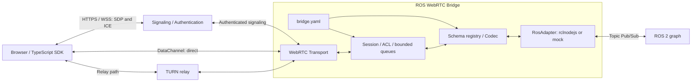

# ROS 2 / WebRTC DataChannel Bridge 設計検討

状態: 構想設計と独立モジュールの試作。実装範囲は§14に限定し、以下の接続API、対応環境、性能値を実装・検証済みとして扱わない。

## 1. 推奨方針と前提

**設定駆動の独立したTopicブリッジを作る。TypeScript / rclnodejsを中心に、WebRTC、セッション、型変換を分離する。** 他のGatewayとは同じROS graphへ接続する独立サービスとして併用できる構成にする。

初期利用者はブラウザの監視UIと操作UIと仮定する。ネイティブクライアントも同じwire protocolを実装できる。1プロセスは1つのROS domainへ接続し、複数のWebRTC peerを受け入れる。ROS 2間の透過DDSネットワーク拡張は対象外とする。

最初の価値は、小〜中サイズのTopicを、用途に応じた配送設定で双方向に扱えること。大容量センサーデータを必須用途とはせず、binary/CDRや断片化の優先度は上げない。センサーデータの型そのものは制限せず、対応codecとpayload上限内のmessageを扱う。

WebRTC採用だけで低遅延や通信成功を保証するとはしない。WAN接続にはシグナリングと、環境によってTURNが必要になる。

## 2. 設計原則

- 宣言的な設定からTopicを公開し、Topicごとの個別handlerを不要にする。
- signaling、session router、ROS adapterを分離する。ROS adapterはHTTPやWebRTCに依存しない小さなinterfaceとする。
- mockと実ROS adapterに共通の契約を設け、protocol試験と実ROS試験を分離する。
- ROS interfaceから公開catalogとJSON Schemaを生成し、設定との二重管理を避ける。
- ROS messageの構造を基本的に維持し、任意field mapping DSLは初期版に含めない。
- publisher/subscriptionの共有keyには、解決済みtopic、type、正規化したROS QoSを含める。異なるQoSを誤って共有しない。
- 型変換はROS schemaに従い、通常のstringを見た目から整数へ変換しない。固定長配列などの制約も送受信両方向で検証する。
- 継続subscriptionと明示的なsnapshot取得を分け、QoSの検証とsessionに結び付いた認可を設ける。

## 3. 全体構成



- **RosAdapter**: 型ロード、ROS entityの生成・破棄、publish、subscription、QoS診断。WebRTCを知らない。
- **SchemaRegistry / Codec**: ROS型定義、wire schema、検証、encode/decode。transportを知らない。
- **SessionRouter**: topic/type/方向の認可、logical subscription、publish handle、sequence、queue、rate制限。
- **WebRtcTransport**: PeerConnection、DataChannel、ICE、送信buffer、接続状態。ROSを知らない。
- **SignalingAdapter**: 認証済みのSDP/ICE交換。ローカルHTTP方式と外部rendezvous方式を同じsession生成処理へ接続する。

共有ライブラリへの抽出は共通interfaceが安定してから行う。Gateway単体で起動・運用できる構成とする。

## 4. 実装技術の比較

| 候補 | 利点 | 制約・採用判断 |
| --- | --- | --- |
| TypeScript + rclnodejs + node-datachannel | TSでアプリを統一でき、libdatachannelのNode bindingが配送設定・buffer APIを提供 | node-datachannel / libdatachannelはMPL-2.0で、本プロジェクトの依存方針では採用対象外 |
| TypeScript + rclnodejs + werift | 同じアプリ構造でWebRTC stackもTS。werift本体はMIT | 優先評価候補。推移依存・配布物を確認し、ブラウザ相互接続・輻輳時負荷を検証 |
| Python + rclpy + aiortc | ROS標準Python型とasyncioを利用しやすい | SDKとサーバーで言語が分かれる。executorとasyncioの所有権分離が必要 |
| C++ + rclcpp + libdatachannel | GenericSubscription / GenericPublisherとserialized dataを扱える | MPL-2.0依存のため現方針では採用対象外。C++化が必要なら方針に適合するtransportを別途評価 |

**TS構成で独立モジュールを試作し、WebRTCライブラリは§14の推移依存の制約を解決してM0で確定する。** SDKとサーバーの型・契約を統一しやすい構成を維持し、[`CONTRIBUTING.md`](../CONTRIBUTING.md) の依存方針に適合するtransportを選定する。

本体のライセンスは [`Apache-2.0`](../LICENSE)。依存ライブラリと配布物のライセンス一覧は採用バージョンごとに記録し、必要な著作権・ライセンス表示を維持する。

一次資料: [rclnodejs](https://github.com/RobotWebTools/rclnodejs)、[node-datachannel](https://github.com/murat-dogan/node-datachannel)、[API](https://github.com/murat-dogan/node-datachannel/blob/master/API.md)、[werift](https://github.com/shinyoshiaki/werift-webrtc)、[aiortc](https://aiortc.readthedocs.io/en/latest/)、[libdatachannel](https://github.com/paullouisageneau/libdatachannel)。

## 5. 設定と公開契約

設定の正本は`bridge.yaml`とし、JSON Schemaで起動時検証する。OpenAPIはHTTP signaling/catalog APIの記述に使い、DataChannel protocolは別のversion付き仕様とJSON Schemaで定義する。AsyncAPI出力は将来の生成物候補であり、v0.1の必須依存にしない。[AsyncAPI仕様](https://www.asyncapi.com/docs/reference/specification/v3.0.0)

`web_to_ros`はWeb clientが送信しGatewayがROS publishする方向、`ros_to_web`はその逆。`publish`の主体が曖昧にならない名前にする。

Web公開名は原則としてROS Topic名と一致させる。`topics`のkeyをWeb公開名とし、`ros_topic`を省略した場合はkeyをROS Topic名として使用する。別名が必要な場合だけ`ros_topic`を明示する。いずれも設定に列挙したTopicだけを公開し、ROS graphの自動公開は行わない。

```yaml
version: 1
robot_id: robot-01
limits:
  max_peers: 4
  max_message_bytes: 16384
  max_peer_queue_bytes: 262144
  max_channel_buffered_bytes: 65536
topics:
  /odom:
    ros_type: nav_msgs/msg/Odometry
    direction: ros_to_web
    ros_qos:
      reliability: best_effort
      durability: volatile
      history: keep_last
      depth: 5
    delivery: realtime
    max_rate_hz: 20
    queue: { policy: latest, max_messages: 1 }
  /cmd_vel:
    ros_type: geometry_msgs/msg/Twist
    direction: web_to_ros
    ros_qos:
      reliability: reliable
      durability: volatile
      history: keep_last
      depth: 1
    delivery: realtime
    max_rate_hz: 30
    queue: { policy: latest, max_messages: 1 }
    access: { publish_scope: teleop, exclusive_writer: true }
    command_guard: { required: true, lease_ms: 250 }
```

これらは初期評価用の値で、性能上限や安全基準ではない。設定例だけで認証基盤が完成するわけではなく、identity validatorと権限policyを別途設定する。未設定の権限は拒否する。lease値は対象ネットワークとcontrollerの停止条件に合わせて決める。

例えば上の`/cmd_vel`のkeyを`/operator/velocity`へ変更し、同じentryへ`ros_topic: /cmd_vel`を追加すると、Web公開名だけを変更できる。ROS remapは接続先へ適用し、Web公開名は設定したkeyのままとする。commandのwriter所有権は別名の数にかかわらず、remap後の正規化したROS出力Topic単位で管理する。

catalogは権限のあるWeb公開名、型、方向、wire schema ID、配送方式、サイズ/rate上限のみを返す。以降のaliasはこのWeb公開名を指す。設定外のTopicや、client指定の任意ROS型を公開しない。HTTPによるschema取得は認証付き・サイズ上限付きとし、大きなschemaを16KiBのDataChannelへ詰め込まない。

設定の読み込みは起動時のみを初期仕様とする。ACL撤回はsession管理の別操作として即時反映する。

## 6. 接続・シグナリング

1. 認証済みclientがrobotに対する接続権限を提示する。
2. Gatewayはidentity、robot、session ID、有効期限、許可された操作を結び付ける。
3. browserをoffererに固定し、固定labelのDataChannelを作成してSDP/ICEを交換する。余分なchannelや不正な配送設定は拒否する。
4. 接続後の`hello`でprotocol major、codec、上限を確認し、catalogから許可されたTopicだけを開く。
5. 切断・失効時はsessionを無効化し、queue、publish handle、leaseを破棄する。

M0はGatewayへ直接到達できるHTTPS offer/answer方式で、ICE gathering完了後にSDPを交換する。インターネット向けv0.1ではロボットから外向きWSSで接続する小さなrendezvousを追加し、trickle ICEを扱う。TURNは別サービスとして接続設定と検証手順を提供する。シグナリングは接続情報交換、TURNは必要時のデータ中継であり役割が異なる。

シグナリングをtrusted boundaryとして扱い、認証したsessionとSDP fingerprintを対応付ける。TLS/DTLSがあるだけでTopic操作が認可されるわけではない。[WebRTC Security Architecture](https://www.rfc-editor.org/rfc/rfc8827.html)

ICE失敗時のv0.1は新しいPeerConnectionとepochを作る。SDKは再認証後にsubscriptionを再登録できるが、publish payloadとcommandの再送は行わない。NAT越えはdirectとrelayの両方を検証し、TURN TCP/TLSやUDP遮断環境の対応は実測した組合せを明示する。[ICE](https://www.rfc-editor.org/rfc/rfc8445.html)、[TURN](https://www.rfc-editor.org/rfc/rfc8656.html)

## 7. DataChannelとwire protocol

1 peerにつき固定3channelにTopicを多重化する。Topicごとにchannelを増やさない。

| label | 設定 | 用途 |
| --- | --- | --- |
| `ros.control.v1` | ordered / reliable | hello、subscribe、unsubscribe、advertise、unadvertise、lease、ack/error |
| `ros.reliable.v1` | ordered / reliable | 欠落より到達を重視する小さな状態通知 |
| `ros.realtime.v1` | unordered / maxRetransmits=0 | 最新値優先のtelemetry、継続的なsetpoint |

`maxPacketLifeTime`と`maxRetransmits`は同時指定しない。各channelは同じSCTP associationの輻輳制御を共有するので、channel分離は帯域や遅延の保証ではない。[WebRTC API](https://www.w3.org/TR/webrtc/)、[RFC 8831 §5, §6.6](https://www.rfc-editor.org/rfc/rfc8831.html)

protocolはrosbridgeのpublish/subscribeの考え方を参考にするが、互換性を宣言しない。session権限、codec、handle、ack意味論が異なるため専用SDKを用意する。[rosbridge protocol](https://github.com/RobotWebTools/rosbridge_suite/blob/ros2/ROSBRIDGE_PROTOCOL.md)

操作例（識別子は説明用、発行済み権限を表すものではない）:

```json
{"v":1,"op":"subscribe","id":"r1","topic":"/odom"}
{"v":1,"op":"subscribed","id":"r1","stream_id":"s1","epoch":"e1","schema_id":"sha256:…"}
{"v":1,"op":"message","stream_id":"s1","epoch":"e1","seq":"42","data":{"header":{},"pose":{},"twist":{}}}
```

最後の`data`は構造説明用の省略形であり、完全なOdometry入力ではない。`advertise`で許可されたaliasに対するpublisher handleを取得し、`publish`はそのhandle、epoch、seq、data、必要ならlease IDを送る。受信側はpeer/sessionとの所有関係も検証する。Topic名を毎回自由入力してpublishするAPIにはしない。

controlとdataの到着順序には依存しない。`subscribed`の後にclientが`ready(stream_id)`を送ってから配信を開始する。clientは`ready`送信前に受信handlerを登録する。unsubscribe直後の飛行中messageはSDKがtombstoneで破棄し、同じsession内でhandleを再利用しない。

- control requestはrequest IDで対応付け、重複要求の応答cacheには件数と期限を設ける。
- `seq`はstream / publisher handle内で単調増加するdecimal string。欠落は許し、逆順・重複を破棄する。ROS publisherが複数ならGateway受信順であり、ROS全体の因果順序ではない。
- publishのackを返す場合は`published_to_ros`を使い、「ROS publish APIが成功した」ことだけを表す。controller受信・処理完了やexactly-onceではない。
- reliable streamのqueue超過は`slow_consumer`として当該streamを停止し、黙って完全配送を装わない。realtime streamは古い値を捨ててdrop数を計測する。
- protocol major不一致は接続拒否、未対応機能は明示エラー。未知operation、過剰なJSON nesting、不正な型/長さは拒否する。

## 8. ROS型とserialization

v0.1は`ros-json-v1` codecとする。ROS interfaceがインストールされ、rclnodejs用bindingを生成済みであることが前提。カスタム型追加でGateway本体のコード変更は不要だが、型packageの配布・binding再生成は必要になる。[rclnodejs interface generation](https://github.com/RobotWebTools/rclnodejs#ros-2-interface-message-generation)

| ROS型 | wire上の表現 |
| --- | --- |
| bool / 通常のstring / 32bit以下整数 | JSON標準型、ROSの範囲を検証 |
| int64 / uint64 | decimal string。型schemaの該当fieldだけを整数へ変換 |
| float32 / float64 | 有限値はnumber、非有限値は該当float fieldに限り`"NaN"` / `"Infinity"` / `"-Infinity"`。commandでは非有限値を拒否 |
| uint8配列 | base64 string。decode後の長さ・上限を検証 |
| その他の配列 / nested message | 再帰的なarray / object。固定長、bounded sequence/stringを検証 |
| Time / Duration | ROSのsec / nanosec構造。wire受信時刻と混同しない |

必須fieldの欠落、未知field、範囲外を拒否し、暗黙のゼロ埋めをしない。定数はdocumentation metadataであり、明示指定なしにenum制約と解釈しない。全対象型の対応可否を起動時に判定し、未知型を部分的なschemaで公開しない。

schema IDはcodec versionを含めて正規化したwire schemaのhashとする。ROS type hashとは区別し、schema変更時は再接続・handle再作成を要求する。

CDRは後続版。binary header、serialization format、型識別、最大サイズ、ブラウザdecoderを合わせて規定してから追加する。Pythonにもraw publish / subscriptionの経路があるため、CDR導入とC++への書換えは別判断にする。[rclpy publisher実装](https://github.com/ros2/rclpy/blob/jazzy/rclpy/rclpy/publisher.py)

## 9. QoS・寿命・負荷制御

ROS QoSとWebRTC配送設定を独立に持つ。ROS側がbest effortなら、DataChannelをreliableにしても既に失われたsampleは回復できない。deadline、liveliness、durabilityをWeb clientまで透過保存するとは定義しない。

best-effort publisherに対するreliable subscriptionなど、QoS不一致を診断へ出す。graphの型と設定の不一致、matched publisher数、incompatible QoSも監視対象にする。[ROS 2公式QoS文書](https://raw.githubusercontent.com/ros2/ros2_documentation/jazzy/source/Concepts/Intermediate/About-Quality-of-Service-Settings.rst)

初期版は設定済みROS entityを起動時に生成する。Webのsubscribe/unsubscribeはsession内の配信登録を操作するだけとし、session切断で共有ROS subscriptionを破棄しない。streamでは`ready`処理後にGatewayが受信した新規sampleのみを配信し、自動的な履歴再生は行わない。process停止時は全entityを解放する。将来lazy生成するなら、topic/type/QoS単位で参照数とcache寿命を管理する。

同一ROS Topicを別aliasで両方向へ公開した場合、Gateway自身がpublishしたsampleも通常のROS受信としてWebへ返る。初期版では送信元の完全な識別・echo抑制を保証しない。SDKは受信messageを自動的にROSへ送り返さず、ブリッジの循環構成は対象外とする。

Web向けsnapshotは、Gatewayが受信した最後の1sampleを時刻・年齢付きで返す独立機能とする。DDSのtransient_local historyや複数publisherの全状態の代替にはしない。`/tf_static`の全変換集約・履歴再現はv0.1の保証外と明記する。

すべての値は設定で制限し、起動時に矛盾を検査する。

- v0.1の単一DataChannel messageは、UTF-8 envelope込みで`min(設定上限, 16KiB, transportの合意上限)`以下。16KiBはアプリの保守的上限で、WebRTC一般の固定上限ではない。
- 断片化はv0.1に入れない。画像・点群・LaserScan等も型だけを理由に拒否しないが、encode後のmessageが上限を超える場合は明示的なサイズエラーとする。
- streamごとのmessage数、peerごとのqueue byte数、process全体のbyte数、DataChannel buffered bytesをすべて上限化する。telemetry cacheも計上する。
- `bufferedAmount`とlow threshold通知で送信を再開する。controlを優先するschedulerを置き、上限超過時にROS callbackを送信待ちでblockしない。
- ROS→JS callbackやevent loop通知自体の滞留も測定する。native側の配送待ちを制限できなければsubscription rateの調整やprocess分離を行い、アプリqueueだけでメモリ上限を保証したことにしない。
- 遅いpeer用のqueueを他peerと分離する。最新値はalias単位でcoalescingし、controlも無制限に蓄積しない。

この方式でも1つのreliable channel上のTopic間には順序待ちがある。用途上問題になる場合は後続版で配送groupやPeerConnection分離を検討する。

## 10. Commandの扱いと認可

監視と操作を別権限にする。Topic、型、方向をdefault denyとし、read可能でもpublish可能とはしない。tokenの期限、session撤回、ACL変更を既存DataChannelにも反映する。

`/cmd_vel`のような継続的なsetpointは次を満たす構成でのみ公開する。

1. ROS remap後の正規化した出力Topic単位でwriterを1 sessionに限定し、明示的なarmで期限付きleaseを発行する。別aliasから同じTopicへ到達しても所有権を共有し、command設定の矛盾は起動時に拒否する。
2. lease IDはsession/epoch/handleに結び付け、期限はGatewayのmonotonic clockで判定する。`now < expires_at` の間だけ有効とし、期限と同時刻以降は拒否する。期限切れleaseは新しいIDを再armで取得する。
3. SDKはleaseを受け取った後に現在の入力からcommandを生成する。古いpayloadへ新しいleaseを付け直したり、切断中の操作をqueueしない。
4. 受信時とROS publish直前に、lease、epoch、sequence、所有権、型・値、rateを再検証する。
5. lease失効後に遅れて届いたpacketだけで操作を再開しない。DDS publisherはvolatileを使い、旧commandをdurabilityで再生しない。

これにより古い通信packetが受理される時間を制限できるが、clientがpayloadを生成した正確な時刻は証明できない。ブラウザの時計を信用したTTLだけで生成時からの遅延上限を保証しない。厳密なage保証が必要なら時計同期と誤差上限を別途設計する。`maxPacketLifeTime`もcommandの有効期限の代用にはしない。

**Gatewayによる期限検証の範囲はROS publish直前まで。** その後のDDS/controller queueでの遅延は残り、volatileでも通常の飛行中commandの遅着は防げない。ROS controller側に入力途絶時のwatchdogを設けるとともに、遅着commandによる再始動を防ぐ用途では、controllerが検証できる期限・世代情報を含むcommand型または専用command gateを使う。上のTwist設定例だけではその保証は成立しない。

汎用bridgeが停止用messageを型から推測しない。ブラウザbackground化、OS suspend、gateway crashも停止条件に含めて試験する。単発の非冪等操作の完了保証はTopicのackへ持ち込まず、将来Service/Actionまたは業務側の応答Topicで設計する。

## 11. MVPと開発段階

| 段階 | 成果物と終了条件 |
| --- | --- |
| M0: 技術PoC | Humble/Jazzyそれぞれの独立したDocker環境で、ROS→browserとbrowser→ROS、3channel、size制限、TURN接続、対象CPUでのbuildを確認。TS transport候補の採用versionとライブラリを決定 |
| M1: LAN向けalpha | 設定検証、型schema、JSON codec、mock、Topic Pub/Sub、HTTP signaling、SDK、queueとepoch。認可なしの公開運用を既定にしない |
| M2: OSS v0.1 | 認証済みrendezvous、TURN手順、leaseとACL撤回、再接続、診断、Humble/Jazzy・複数browserのCI、配布・双方向サンプル・protocol文書 |
| M3: 実測後の拡張 | 実需要に応じてbinary/CDR、有界断片化、lazy entity、AsyncAPI export、追加言語SDKを検討。大容量センサーデータ向け機能は初期版の前提にしない |

v0.1の対象はTopicのみ。Service、Action、Parameters、映像/音声MediaTrack、SFU、多数ロボットの管理画面、自動ROS-to-ROS中継は含めない。連続動画を扱う場合は将来MediaTrackを別機能として検討する。

初期対応対象は **ROS 2 Humble / Ubuntu 22.04とROS 2 Jazzy / Ubuntu 24.04** とする。distroごとにDockerコンテナを独立起動し、build、型binding、双方向Pub/Sub、QoSを検証する。検証用の対向ROS nodeも隔離された検証graphへ接続し、host上の既存ROS環境への混入を避ける。両distroのテスト条件は [TESTS.md](../TESTS.md) で定める。

Linux amd64 / arm64をCPU候補とし、対象端末のarchitectureとnative依存の検証結果に基づいて対応範囲を確定する。Nodeとrclnodejsのversionを固定し、distroを跨ぐ共通versionが使えるかをM0で確認する。これらは対応方針であり、対応済み宣言ではない。

双方向サンプルは、Webから入力Topicへpublishし、ROSの対向nodeから出力Topicを受信する経路を用意する。bindingには実際に確認した型とQoSを指定し、Topic名から型を推測しない。

構成案:

```text
packages/bridge/       # config, sessions, schemas, ros adapters, transport
packages/client/       # browser TypeScript SDK
packages/signaling/    # optional authenticated rendezvous
schemas/               # config / protocol JSON Schema
examples/              # chatter, odometry, guarded teleop
tests/                 # protocol, ROS integration, browser, network impairment
docs/                  # architecture, protocol, deployment, compatibility
```

## 12. QA・受け入れ条件

具体的な受け入れ条件、テスト層、環境matrix、CI / release gate は [TESTS.md](../TESTS.md) に集約する。本書は機能と保証範囲、[CONTRIBUTING.md](../CONTRIBUTING.md) は共通の品質基準を定める。

型の往復、QoS互換性、channel間の順序、資源上限、認可、旧command拒否、接続経路、resource解放を検証する。mockは実ROS / browser / TURNの検証の代わりにはしない。controller側の期限検証はGateway単体と分けて評価する。

診断はpeer数、ICE状態/direct・relay経路、ROS matched数/QoS不一致、topic別rate/bytes/drop、queue滞留、bufferedAmount、publish拒否理由を持つ。payload・認証情報は既定logに出さない。

レイテンシp50/p95/p99、CPU、RSS、接続確立時間をサイズ/rate/CPU/browser/network条件付きで測る。異なる端末の時刻差をそのまま片道遅延にせず、同期誤差を評価するか往復測定を使う。SLOはPoC結果と実用途から設定し、現段階で未測定のms値や同時接続数を保証しない。

## 13. 決定事項と未確定事項

| 項目 | 設計方針 |
| --- | --- |
| 大容量センサーデータ | 必須用途とせず、型だけで禁止しない。payload上限を維持し、binary/CDR・断片化の優先度は上げない |
| 初期ROS distro | HumbleとJazzyの両方を対象とする |
| 検証環境 | distroごとのDockerコンテナで独立起動し、両方向のPub/Subを検証する |
| Web公開名 | 原則ROS Topic名と一致させ、YAMLで別名の定義も可能とする |

M0では、次の事項を検証・確定する。

- weriftの推移依存・配布物のライセンス適合、ブラウザ相互接続、性能条件。
- 対象端末のCPU architecture、Node/rclnodejsのversion、対応browser、認証基盤、TURN配置。
- サンプルTopicの型・QoSと対向nodeの契約。
- controller側watchdog・期限検証の契約、必要なlatency/rateと性能budget。

対応環境と性能条件は、検証結果に基づいて公開する。

## 14. モジュール試作の契約と残る接続境界

`packages/bridge/src/`にconfig、codec、sessionの内部APIを実装している。これらは外部I/Oを持たず、Unitとモジュール結合試験で契約を確認する。ROS / WebRTCの双方向通信を満たすM0は未完了である。

### 起動設定

[設定loader](../packages/bridge/src/config/README.md)は[bridge.yaml](../examples/bridge.yaml)を検証し、変更できないbinding配列を返す。型loaderによる確認済み型名一覧と、ROS adapterのremap関数を注入する。公開名は保持し、writer所有権には解決済みROS名を使う。同一出力Topicへ向かうaliasで、型・QoS・access・guard・rate・配送・queueが食い違う場合は起動を拒否する。

初期実装のQoS historyは`keep_last`のみ。配送設定はreliableなら有限FIFO、realtimeなら1件のlatestを必須とする。設定mapの未知field、重複key、YAML alias、独自tagを拒否し、設定文書のUTF-8 byte数とTopic数も制限する。名前は絶対ASCII名、247文字以下とし、native側のRMW検証もadapterで行う。[RMW完全Topic名の検証](https://github.com/ros2/rmw/blob/jazzy/rmw/include/rmw/validate_full_topic_name.h)

### 型変換

[codec](../packages/bridge/src/codec/README.md)は明示したfield descriptorを生成時にsnapshotする。64bit整数はnative側`bigint`、wire側canonical decimal string、uint8列はnative側`Uint8Array`、wire側padding付きcanonical base64に固定する。float32はbinary32へ丸めてoverflowを拒否する。string上限はUTF-8 bytesとし、孤立surrogateを拒否する。

型値は欠落・未知field、配列のhole・追加property、getter等を暗黙に捨てない。commandには`allowNonFinite: false`を必須指定する。descriptor/payloadの深さ、node数、配列長、string/bytes長はfactory optionで制限する。native値をplain objectへ正規化するrclnodejs adapterと、ROS型からdescriptor / schema hashを生成する部分は未実装である。

### Commandとqueue

[CommandGuard](../packages/bridge/src/session/README.md)はsession、handle、leaseを再利用しないIDで管理し、Topicごとのlease時間をhandle生成時に固定する。`seq`はcanonical uint64 decimal stringとし、上限到達時は新しいhandleを取得する。受信時にseqを消費し、publish時も順序を検証する。ticketは成功・失敗を問わず1回だけ使用でき、ROS APIの例外でもseqを巻き戻さない。同じsessionの別handleで再armした場合も、同一ROS出力の旧leaseを失効させる。

認可hookの後にも所有状態を再取得し、撤回済みstateを使わない。clockは副作用のない単調clockを注入する。最終検証からROS publishまでは同期処理とし、`await`を挟まない。型・値・rateの受信時／publish直前検証は上位sessionの責務である。module結合試験ではpayloadをsnapshotして待機中の外部変更を隔離するが、製品のsession routerは未実装である。

`DeliveryQueue`は1 peerのencode済みenvelope bytesをcopyして保存する。latestは旧値を捨て、peer上限に新値も収まらなければ新値を捨ててdropを計測する。reliableの上限超過は待機値を解放してstreamを停止する。設定の`fifo`はqueue APIの`reliable`に対応する。dequeue後のtransport buffer、process全体budget、rate、ready gate、control優先schedulerは別途実装する。

### Transport採用の制約

`werift`本体がMITでも推移依存の適合確認が必要である。`werift 0.24.4`は`mediabunny`へ依存し、対象版のlicenseはMPL-2.0であるため現行の依存方針では導入しない。[weriftの依存定義](https://github.com/shinyoshiaki/werift-webrtc/blob/v0.24.4/packages/webrtc/package.json)、[mediabunny 1.45.2の配布metadata](https://registry.npmjs.org/mediabunny/1.45.2)

採用可能なDataChannel実装・配布構成を確定してから、rclnodejs adapter、3channel、signaling、ブラウザSDKを接続する。Humble/JazzyのDocker環境で独立ROS nodeとの双方向通信、実ブラウザ、TURNを検証するまで、環境対応やM0完了を宣言しない。
